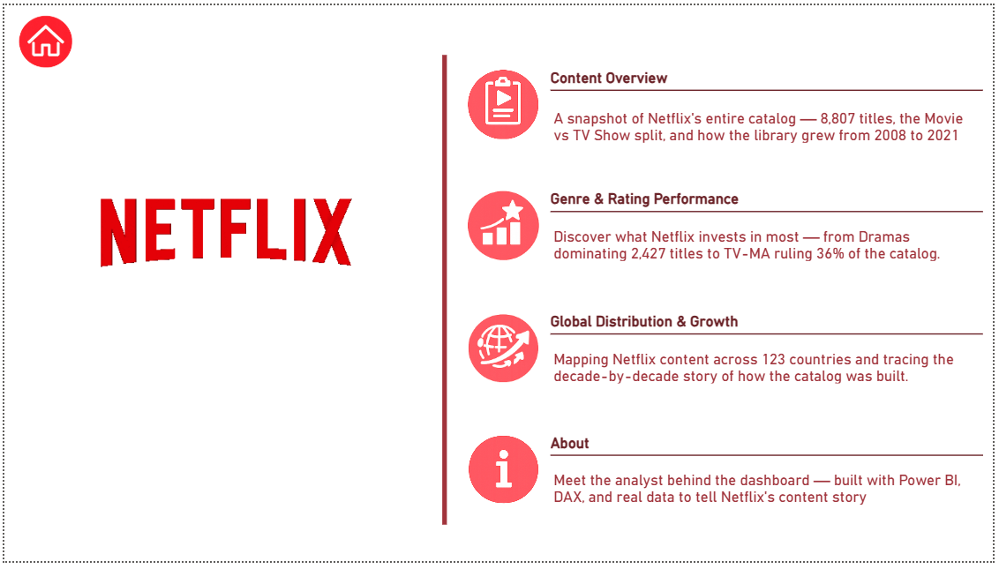

# 🎬 Netflix Content Analytics Dashboard (Power BI)

An interactive **Power BI dashboard** analyzing Netflix's global content catalog.
This project transforms raw data into **clear insights about content growth, genre distribution, ratings, and global production trends.**

The dashboard demonstrates **data modeling, KPI design, storytelling, and interactive analytics.**

---

# 📊 Dashboard Navigation

The report contains **three analytical dashboards** and one introduction page.

| Page                         | Purpose                                  |
| ---------------------------- | ---------------------------------------- |
| Overview                     | Introduction to dashboard sections       |
| Content Overview             | Platform catalog distribution and growth |
| Genre & Rating Performance   | Content genre and rating analysis        |
| Global Distribution & Growth | Country production and catalog expansion |

---

# 🏠 Dashboard Landing Page

This page introduces the **analytical structure of the report**.

### Sections Explained

**Content Overview**
Explores Netflix's catalog size, content types, and growth trends.

**Genre & Rating Performance**
Analyzes genre popularity and audience rating categories.

**Global Distribution & Growth**
Investigates international content production and historical growth.

**About**
Information about the analyst and project details.

---

# 📈 Content Overview

This dashboard analyzes **Netflix's catalog structure and expansion over time.**

---

## Key Metrics

| Metric         | Value | Meaning                          |
| -------------- | ----- | -------------------------------- |
| Total Titles   | 8,807 | Total entries in Netflix catalog |
| Total Movies   | 6,131 | Number of movies available       |
| Total TV Shows | 2,676 | Number of series available       |
| Movie Share    | 69.6% | Percentage of movies in catalog  |

### Insights

* Netflix catalog contains **8,807 titles**.
* Movies dominate the platform with **~70% share**.
* TV Shows represent **~30% of content**.

---

## Content Type Split

Visualizes the **proportion of movies vs TV shows.**

Insight:

* Netflix focuses heavily on **movie content expansion**.

---

## Content Growth (2008–2021)

Shows the **number of titles added over time.**

Key insights:

* Slow growth before **2015**
* Rapid expansion **2016–2019**
* Peak catalog additions occurred around **2019**

This corresponds to Netflix’s **global expansion strategy.**

---

## Annual Additions by Content Type

Displays yearly additions of:

* Movies
* TV Shows

Insights:

* Major growth between **2017–2020**
* Movies increased faster than TV shows.

---

## Content Volume vs YoY Growth

Compares **catalog size with growth rate.**

Insights:

* Highest growth spikes occurred during **early platform expansion**
* Growth stabilizes as catalog matures.

---

# 🎭 Genre & Rating Performance

This dashboard explores **content categories and audience ratings.**

---

## Key Metrics

| Metric             | Value  | Meaning                           |
| ------------------ | ------ | --------------------------------- |
| Unique Genres      | 42     | Distinct content categories       |
| Top Genre          | Dramas | Most common storytelling category |
| Most Common Rating | TV-MA  | Mature audience content dominates |

### Insights

* Netflix offers **42 genre categories**.
* **Drama is the most dominant genre.**
* **TV-MA rating leads the platform**, indicating strong adult audience focus.

---

## Ratings by Content Type

Breakdown of ratings across:

* Movies
* TV Shows

Insights:

* **TV-MA dominates both categories**
* TV-14 appears as the second most common rating.

---

## Genre Weight (Treemap)

Displays the **relative share of genres**.

Largest categories include:

1. International Movies
2. Dramas
3. Comedies

Insight:

Netflix invests heavily in **international content production**.

---

## Top 10 Genres

Top genres based on number of titles.

| Genre                  | Titles |
| ---------------------- | ------ |
| International Movies   | 2752   |
| Dramas                 | 2427   |
| Comedies               | 1674   |
| International TV Shows | 1351   |

Insight:

International content is a **major part of Netflix's catalog strategy**.

---

# 🌍 Global Distribution & Growth

This dashboard analyzes **country production and historical release patterns.**

---

## Key Metrics

| Metric                 | Value         |
| ---------------------- | ------------- |
| Average Movie Duration | ~100 minutes  |
| Top Producing Country  | United States |
| Countries Represented  | 123           |
| Peak Content Year      | 2019          |

Insights:

* Netflix content spans **123 countries**.
* **United States dominates production**.
* **2019 recorded the highest number of titles added.**

---

## Top 10 Countries Ranked

Country contribution to Netflix catalog.

| Country        | Titles |
| -------------- | ------ |
| United States  | 3686   |
| India          | 1045   |
| United Kingdom | 804    |
| Canada         | 445    |

Insight:

India is the **second-largest content contributor**, highlighting Netflix’s expansion into emerging markets.

---

## Catalog by Release Decade

Shows how content is distributed across decades.

Insights:

* Most titles are from **2000 onwards**
* Older content appears less frequently.

---

## Growth Trend (Volume vs YoY Rate)

Combines:

* Catalog size
* Year-over-year growth

Insights:

* Strong growth between **2016–2019**
* Slight stabilization after **2020**

---

# 🧠 Skills Demonstrated

This project showcases:

* Data cleaning and preparation
* Data modeling
* KPI development
* Interactive dashboard design
* Data storytelling
* Insight generation

---

# ⚙️ Tools Used

| Tool        | Purpose               |
| ----------- | --------------------- |
| Power BI    | Dashboard development |
| Power Query | Data transformation   |
| DAX         | Calculations          |
| Excel       | Data preprocessing    |

---

# 📂 Dataset

Dataset Source: **Netflix Titles (Kaggle)**

Dataset includes:

* Title
* Type
* Genre
* Country
* Rating
* Duration
* Release Year
* Date Added

Total records analyzed: **8,807**

---

# 👨‍💻 Author

**Anshul Kumar**
Aspiring Data Analyst

This dashboard was created as a **portfolio project demonstrating business intelligence and analytics skills.**

---

# 📬 Contact

📧 Email
[anshulz18874@gmail.com](mailto:anshulz18874@gmail.com)

🔗 LinkedIn
https://www.linkedin.com/in/anshul-kumar-dataanalyst/

📺 YouTube
http://www.youtube.com/@AnshulKumar_Data_Analyst
